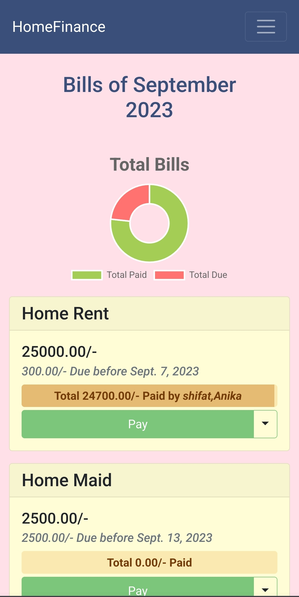
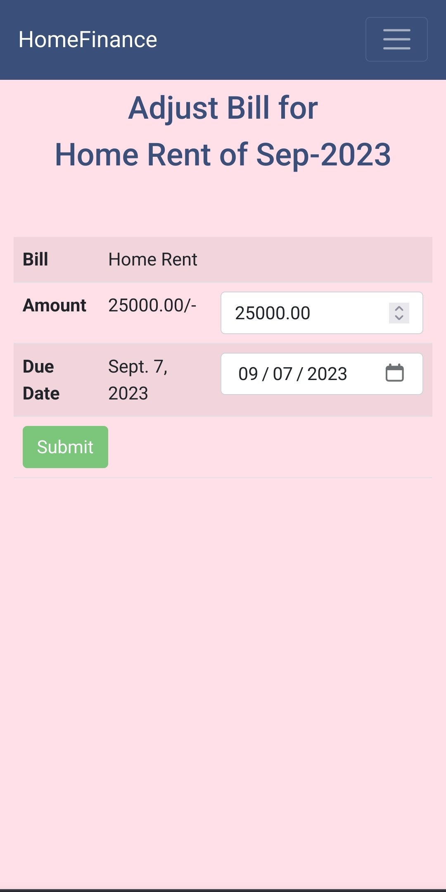
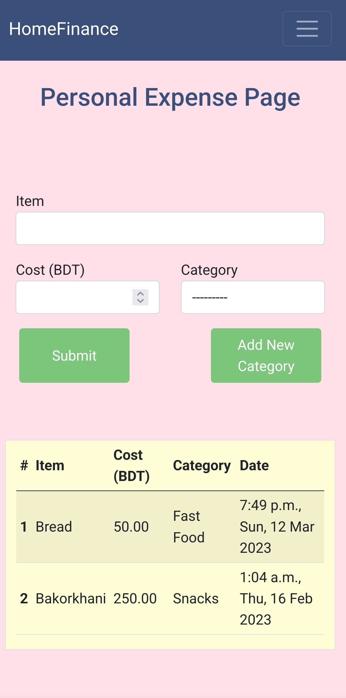
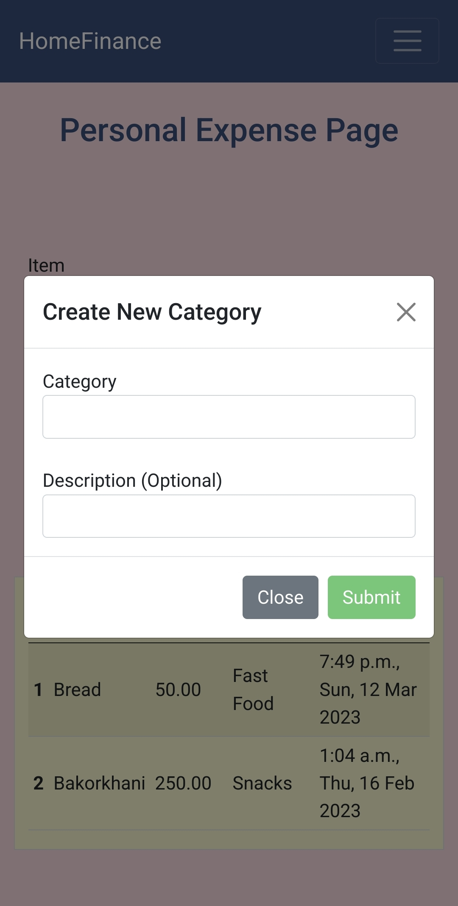
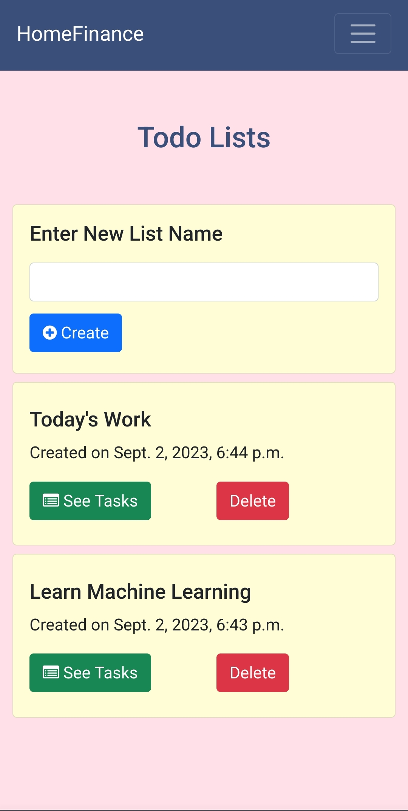
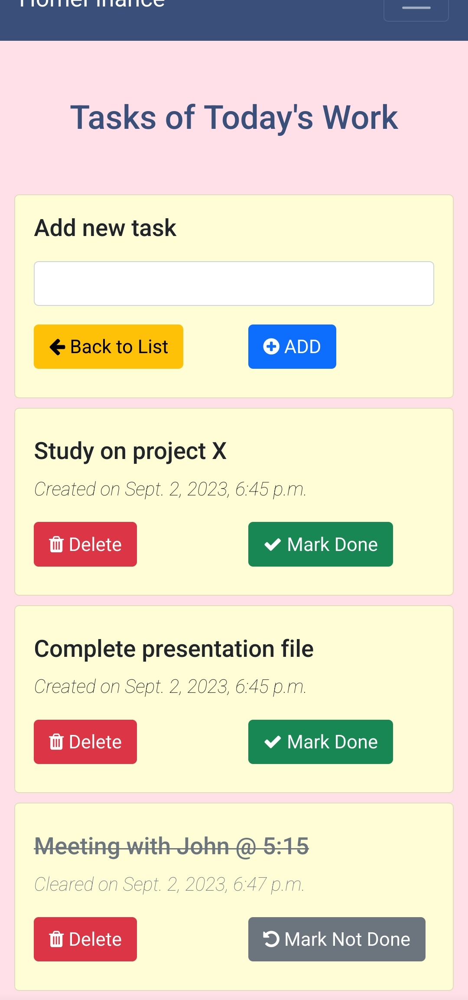

# Home Finance

A nifty web app to keep track of my home's monthly expenses and some personal utility.

## Tech stack

* [Django](https://www.djangoproject.com/)
* [PostgreSQL](https://www.postgresql.org/)
* [Bootstrap 5](https://getbootstrap.com/docs/5.0/getting-started/introduction/)

Developed and hosted on Raspberry Pi 4 with [neovim](https://github.com/s-shifat/dotfiles/tree/main/nvim) as code editor.

## Features

* Multi account support for family members and shared payment information records for each bill
* Monthly fixed bills records plus bill adjustments
* Personal expenses records
* Personal TODO list

## Setup Locally

1. Install requirements:
   
   ```shell
   pip install -r requirements.txt
   ```

2. To launch on local host:

   ```shell
   python manage.py runserver
   ```
3. *(Optional)* To launch on a Raspberry there are [many ways](https://raspberrypi-guide.github.io/programming/run-script-on-boot). I followed this one:
    
    3.1. ssh into your pi.

    3.2. Make [`start.sh`](./start.sh) executable
    ```shell
    sudo chmod +x ./start.sh
    ```

    3.3 Edit your `/etc/rc.local` file.
    ```shell
    sudo vim /etc/rc.local
    ```
    The last satement in this file is `exit 0`. You will add the following line just before it:
    ```shell
    bash absolute_path_to_start.sh &
    ```
    replace `absolute_path_to_start` with absolute path of [start.sh](./start.sh) in your rasberry pi.

4. *(Optional)* To configure other databases you can use [`creds`](./creds/) directory. Here's an example to use [PostgreSQL](https://www.postgresql.org/):

    4.1 Install and setup PostgreSQL in your system. I followed [this](https://pimylifeup.com/raspberry-pi-postgresql/) guide. Make note of name, password, server and port.

    4.2 Create a copy of [sqlite_db.py](./creds/sqlite_db.py) inside [`creds`](./creds/) directory and rename it to something like `postgresql_db.py`.

    4.3 Now edit the file as following with your proper credentials:

    ```python
    MY_DB_CONFIG = {
        'ENGINE': 'django.db.backends.postgresql_psycopg2',
        'NAME': 'your_db_name_here',
        'USER': 'your_user_name_here',
        'PASSWORD': 'your_password_here',
        'HOST': 'host_url_here',
        'PORT': 'port_here',
    }
    ```

    4.4 Now use it in the [`settings.py`](./home_fin/settings.py) accordingly:


    Import the `postgresql_db.py` file you have just created.

    ```python
    from creds.postgresql_db import MY_DB_CONFIG
    ```
    Then, look for the dictionary named [`DATABASES`](https://github.com/s-shifat/home-finance/blob/42cf61d9496d2fa168a6027235dc416b62a07e31/home_fin/settings.py#L86) and make it look like:
    ```python
    DATABASES = {
        "default": MY_DB_CONFIG,
    }
    ```
    ... And that's it!

    [Here](https://stackpython.medium.com/how-to-start-django-project-with-a-database-postgresql-aaa1d74659d8) is another comprehensive example.

## Screenshots

### Dashboard




### Bill paymenet or adjustments


Pay Bills



Adjust Bills

### Personal Expense





Create categories too!

### Todo Lists


Create separate lists

Add tasks and mark/unmark tasks!



